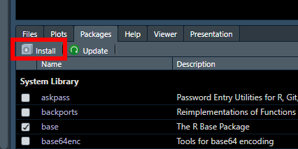
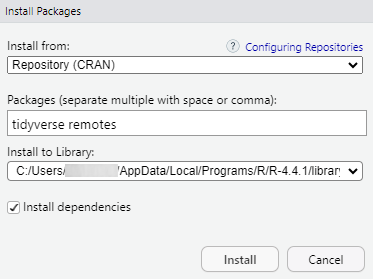

```{r, include = FALSE}
knitr::opts_chunk$set(
  collapse = TRUE,
  comment = "#>"
)
```

This is a brief, basic guide to setting up R, RStudio, and `microCTr` for the
first time. It assumes you're using Windows.

# Install R

Download R and install it. It does not require administrator privileges.

https://cloud.r-project.org/bin/windows/base/

# Install RStudio

Likewise, download RStudio and install it. It also does not require
administrator privileges.

https://posit.co/download/rstudio-desktop/

# Install Prerequisite R Packages

We need to make sure the `tidyverse` R package is installed. We'll also use the
`remotes` package to install `microCTr`, so that will need to be installed as
well. 

## Using the RStudio GUI

Click `Install` in the `Packages` pane:

```{r echo = FALSE}

```

Then, type `tidyverse` and `remotes`, and click `Install`:

```{r echo = FALSE}

```

## Using the R Console

Alternatively, you can type the following into the R console:

```{r eval = FALSE}
install.packages(c("tidyverse", "remotes"))
```

# Install microCTr

Since microCTr is a package under development and not on CRAN, it must be
installed differently. Type the following into the R console:

```{r eval = FALSE}
remotes::install_github("ricompute/microCTr")
```

