```{r, include = FALSE}
knitr::opts_chunk$set(
  collapse = TRUE,
  comment = "#>"
)
```

This is a step-by-step guide to running a standard microCT analysis using
microCTr. It assumes you already have your data exported from the scanner into
text files.

# Create an RStudio Project

The first step is to create a folder that will contain your data and analysis.

First, open RStudio. Then, create a new RStudio project: `File > New Project...`

Select `New Directory`:

```{r echo = FALSE}
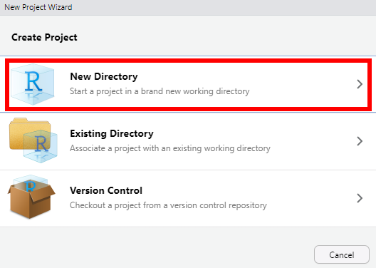
```

Select `New Project`:

```{r echo = FALSE}
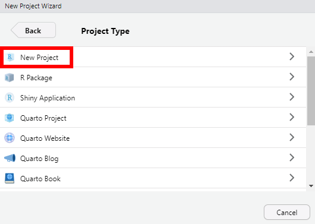
```

Type the name of the folder you would like to create, and select the location
you would like to create the folder. Then click `Create Project`:

```{r echo = FALSE}
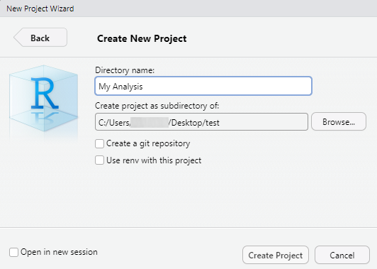
```

You should now have a new folder which contains a `.Rproj` file with the name of
the project and a `.Rproj.user` folder.

```{r echo = FALSE}
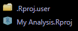
```

These are safe to ignore, but don't delete or move them.

# Generate Templates for Your Analysis

Click the `Addins` button at the top of RStudio:

```{r echo = FALSE}
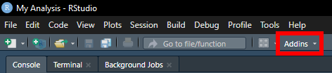
```

Select `microCT Genotype Comparison Setup` or `microCT Treatment Comparison
Setup`, depending on which type of analysis you are going to run.

```{r echo = FALSE}
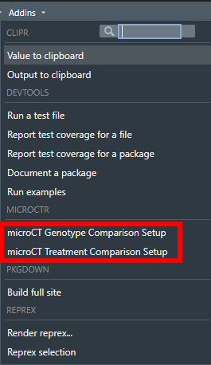
```

You should now have two new files in your working folder, a `.Rmd` file labeled
with today's date and a `data.xlsx` file.

```{r echo = FALSE}
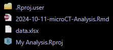
```

# Prepare Your Data

The `data.xlsx` file is a template Excel file into which you should paste your
data. There are separate sheets for `Trabecular`, `Twice1`, `Twice2`, and `MFE`
data. Additionally, there's a `Key` sheet. 

```{r echo = FALSE}
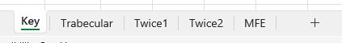
```

The data sheets have green highlighted columns which indicate the data of
interest. Examine these carefully to make sure there are not characters besides
numbers (such as `!` or `~`), since this will affect the analysis. If any of
these other characters are present, delete them, leaving only the number.

The `data.xlsx` file can be renamed whatever you want, but you will have to
update this name in the final report. Don't worry, I'll show you how to do that
when we get there.

The `Key` sheet is where you should specify the animal's AS number, sex, group
(genotype or treatment), sample number, and the measure numbers for the spine,
metaphysis, and diaphysis. For example:

```{r echo = FALSE}
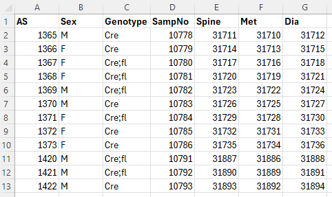
```

# Prepare the Report

Now that the data are prepared, we'll turn to generating the final report. Open
the `.Rmd` file in RStudio. You can do this by clicking on the file name in the
`Files` pane:

```{r echo = FALSE}
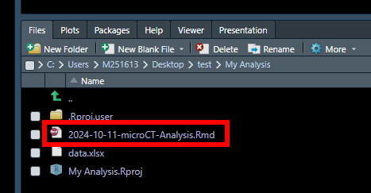
```

The `.Rmd` file is just a text file, and it should now be open for editing
within RStudio:

```{r echo = FALSE}
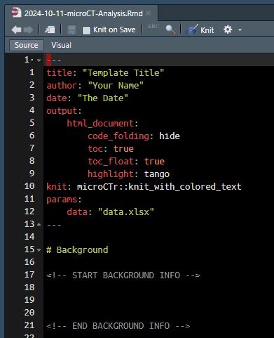
```

Replace `Template Title` with the title you'd like to give the report, `Your
name` with your name, and `The Date` with today's date. For example:

```{r echo = FALSE}
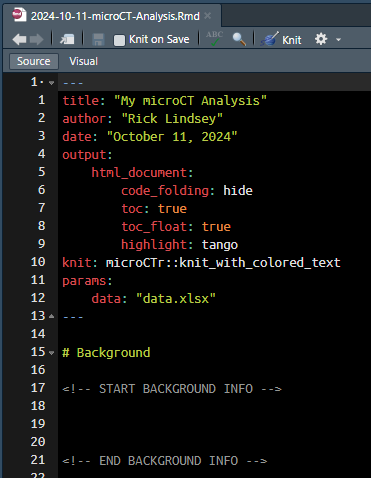
```

If you have changed the name of the `data.xlsx` file, here's the place to update
that information. Be sure to include the `.xlsx` file name extension!

Don't change any of the other information at the top of the `.Rmd` file.

Optionally, you can add background information about the project to be included
in the final report. Type it in the first section, in the lines between `START
BACKGROUND INFO` and `END BACKGROUND INFO`. Don't change anything else lower
down in the file.

Make sure your file is saved by pressing `Ctrl + S` or clicking the `Save`
button:

```{r echo = FALSE}
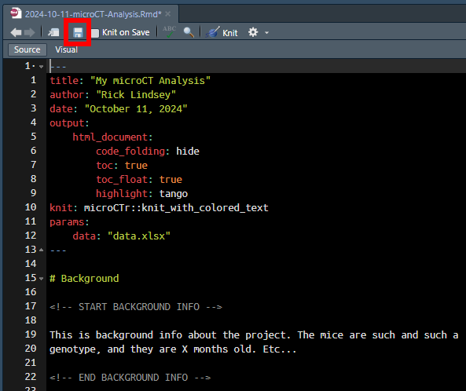
```

Now, generate the report by clicking `Knit` (or by pressing `Ctrl + Shift + K`):

```{r echo = FALSE}
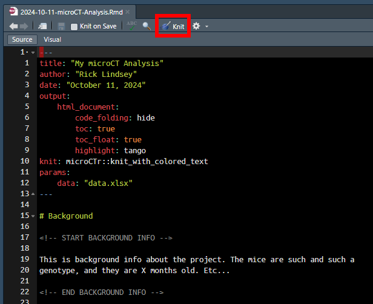
```

After a few seconds, the final report should appear in the `Viewer` pane:

```{r echo = FALSE}
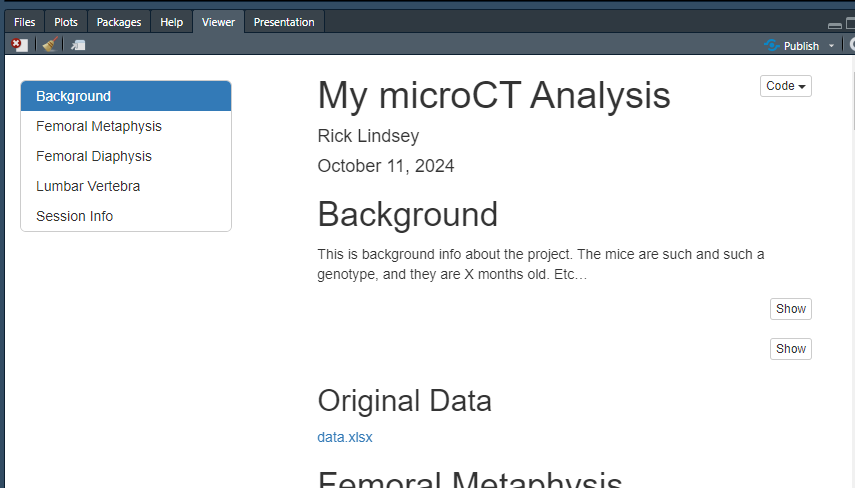
```

The final report is now in a `.html` file in your working folder:

```{r echo = FALSE}
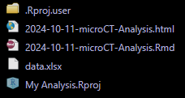
```

You can do anything you would do with a regular file with this `.html` file:
save it anywhere you like, attach it to an email, etc. You can also double click
it to open it in your default web browser for easier viewing.
